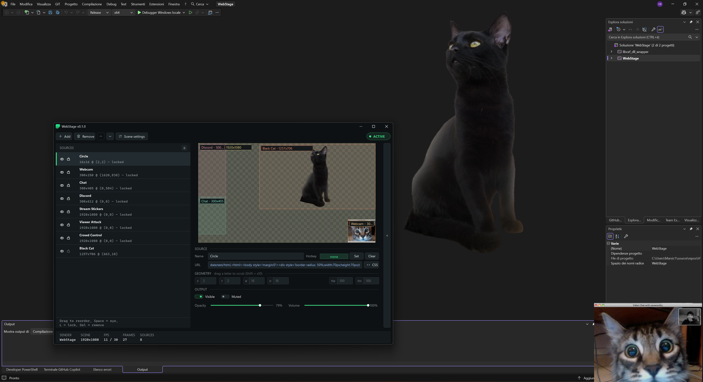
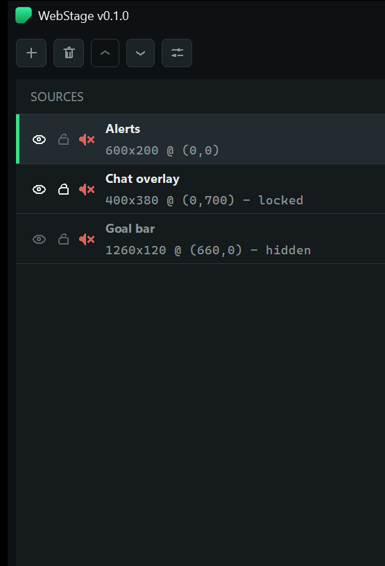
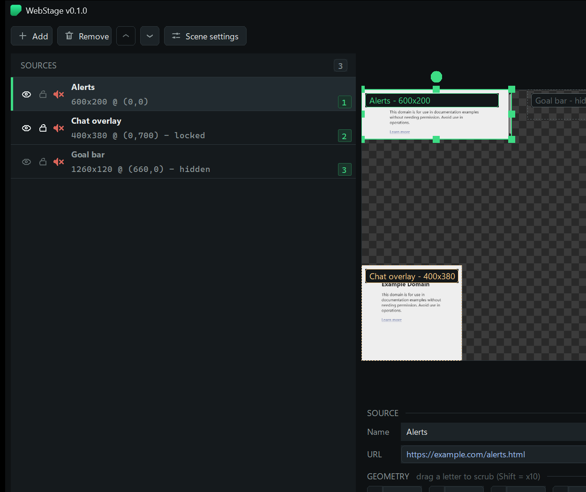
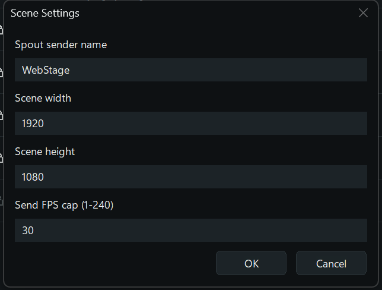
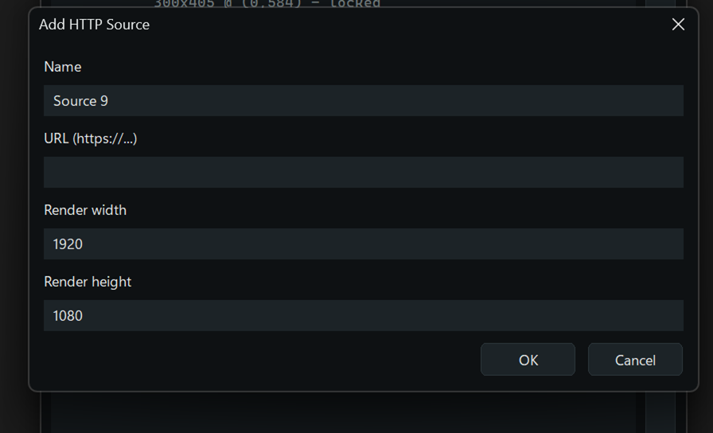

# WebStage

A lightweight OBS replacement for compositing HTTP overlay pages into a scene and sending it over **Spout2** — native C++, zero Electron, zero browser windows.

The name is the metaphor: a **stage** where web layers are placed, shown and hidden on cue (your hotkeys are literally lighting cues), and the Spout output is the show.

> 🎭 **Made to be used with [Spout2OverlayHUD](https://github.com/Marsic1/Spout2OverlayHUD)** — WebStage composites the scene, Spout2OverlayHUD displays it as a clickthrough fullscreen HUD (webcam, chat, stickers, crowd interactions over your game on a single monitor). Set WebStage's sender name to whatever the HUD listens for and you're live:
>
> 

## Why not just OBS?

Measured head-to-head on the same machine (RTX 5090, 32 cores), same 6 browser overlays (three animated 1080p pages), both idling at 30 fps output, 60-second averages:

| | CPU (% of one core) | RAM (private) | GPU |
|---|---|---|---|
| **WebStage** | **13.1** | **1072 MB** | **0.9%** |
| OBS 32 (scene + preview, no stream/record) | 20.1 | 1142 MB | ~1.0% |

WebStage uses roughly **a third less CPU**, slightly less RAM and GPU. How: GPU shared-texture frames from Chromium (no CPU readback), event-driven compositing (nothing re-renders or re-sends while the scene is static — note the FPS readout drops below the cap when idle; that's the app correctly doing nothing, unlike OBS's fixed 30/30 re-render), per-frame diagnostic logging off by default, and no studio machinery around the compositor. (OBS's status-bar CPU meter only counts its main thread — Task Manager's per-process sum is the honest comparison.)

## Screenshots

Compact list mode and expanded editor with live preview:




Scene settings and the add-source dialog:




## Usage

1. Run `WebStage.exe` (it needs the files next to it — see below — plus a `scene.json`; one is created on first run).
2. **Add** a source: paste an overlay URL (Stream Stickers, Social Stream Ninja, VDO.Ninja, Discord StreamKit, …), set render size, place it in the preview by dragging.
3. Lock finished sources so they can't be dragged by accident. Eye toggles visibility, hotkeys toggle on cue. Per-source CSS restyles pages OBS-browser-source style.
4. Set the **sender name** (Scene settings) to match your receiver and flip the **ACTIVE** pill. That's the whole show.

### Your scene is one portable file

Everything — sources, URLs, geometry, render sizes, volume/mute/opacity, locks, hotkeys, custom CSS, sender name, FPS cap, canvas size — lives in **`scene.json`** next to the exe. Copy it to another PC (alongside the run folder) and you get the exact same windows and settings there. Back it up to restore your setup after a reinstall. Every save also keeps a `scene.json.bak` safety copy.

### Using raw HTML as a source (no URL needed)

Put a `data:` URL in the URL field. Important: the app forces `html`/`body` transparent (that's how compositing works), so **paint on a `<div>`, not the body**:

```
data:text/html,<html><body style='margin:0'><div style='width:100px;height:100px;background:red'></div></body></html>
```

A circle badge, like the one in the screenshots:

```
data:text/html,<html><body style='margin:0'><div style='width:70px;height:70px;background:#3DDC84;border-radius:50%'></div></body></html>
```

Set the source geometry to match (100×100 here, render size = scene size) and lock it when placed.

## Running it

A run folder needs exactly: `WebStage.exe`, `scene.json` (your scene — auto-created, auto-saved, with a `scene.json.bak` safety copy on every save), and the Chromium runtime files next to the exe (`libcef.dll`, `resources.pak`, `icudtl.dat`, locales, ANGLE/SwiftShader libs — these ship Chromium-style and cannot be embedded inside the exe; every CEF app from Spotify to Steam does the same).

Point [Spout2OverlayHUD](https://github.com/Marsic1/Spout2OverlayHUD) at the sender name and the scene appears as your overlay HUD.

## Building from source

- Windows 11, Visual Studio 2026 (v145 toolset), Windows SDK, C++20. NuGet packages restore automatically (`packages.config`).
- Chromium is **not** in git (~300 MB, exceeds GitHub file limits): download `cef_binary_144.0.34+g8fc21c8+chromium-144.0.7559.261_windows64_minimal` from [cef-builds](https://cef-builds.spotifycdn.com/index.html), then copy its `Release/*` → `WebStage/third_party/cef/bin/` and `Resources/*` → `WebStage/third_party/cef/resources/` (`include/` and `libcef_dll/` are already vendored).
- Open `WebStage.sln`, build Release|x64, run `x64/Release/WebStage.exe`.
- Shaders are precompiled (`WebStage/Shaders.h`, generated with `fxc /T <vs_5_0|ps_5_0> /E main /O3`) so the app ships without `d3dcompiler_47.dll`. Flags: `--verbose` (per-frame logging), `--cpu-paint` (skip the GPU texture handoff), `--snapshot/--quit-after` (automation).

## 🔗 Recommended projects

- 🎭 **[Spout2OverlayHUD](https://github.com/Marsic1/Spout2OverlayHUD)** — the other half of this setup: displays any Spout2 sender (this app) as a clickthrough HUD. Use them together.
- 🎥 [VDO.Ninja](https://vdo.ninja/) — webcam overlay
- 💬 [Social Stream Ninja](https://socialstream.ninja/) — chat overlay
- 🎭 [Stream Stickers](https://streamstickers.com/) — interactive stickers
- 🎮 [Viewer Attack](https://www.viewerattack.com/) — throwable effects
- 🕹️ [Crowd Control](https://crowdcontrol.live/) — viewer-controlled game interactions

## 🔮 Roadmap

- **NDI output** alongside Spout (same scene, second sender).
- **NDI and Spout inputs** as sources — not just HTTP pages.

## ❤️ Support

If WebStage runs your stream, consider supporting development:

[](https://ko-fi.com/marsic1)
